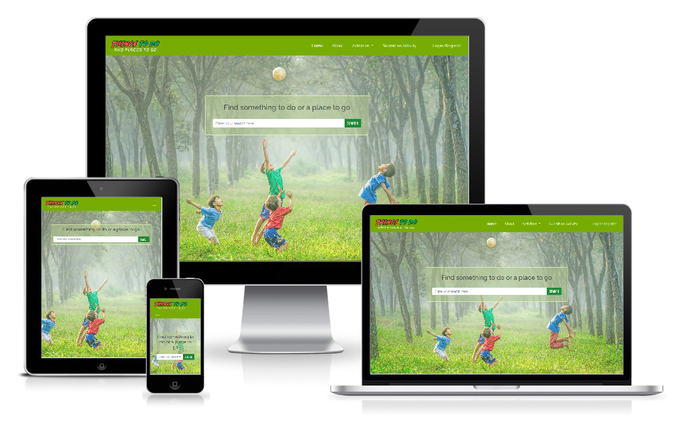

# Things To Do Places To Go

The live deployed site can be accessed using the following link: [Things To Do Places To Go](https://things-to-do-project.herokuapp.com/)

## Table of Contents
- [Summary](#summary)
- [Business Goals](#business-goals)
- [Customer Goals](#customer-goals)
- [Advertiser Goals](#advertiser-goals)
- [UX](#ux)
  * [Ideal Customer:](#ideal-customer)
  * [Ideal Advertiser:](#ideal-advertiser)
- [User Stories](#user-stories)
  * [Customer](#customer-stories)
  * [Advertiser](#advertiser-stories)
- [Information Architecture](#information-architecture)
- [Wireframe Designs](#wireframe-designs)
- [Surface](#surface)
- [Technologies Used](#technologies-used)
- [Features](#features)
- [Future Features](#future-features)
- [Testing](#testing)
- [Running Locally and Deployment](#running-locally-and-deployment)
- [Credits](#credits)
  * [Text content](#text-content)
  * [Logo](#logo)
  * [Photos](#photos)
  * [Code](#code)
- [Acknowledgments](#acknowledgments)
- [Disclaimer](#disclaimer)

## Summary
The purpose of the ‘Things To Do Places To Go’ project is to create a website which will
allow people to find activities to do. From small adventures in the garden, to big
adventures on days out.  Eventually advertisers will be able to use the site to display
their banners.

## Business Goals

- Create an easy to use website which will keep users coming back time-after-time with a growing database of activities.
- Allow users to submit their own activity ideas.
- Allow advertisers to have banners on the website to help generate revenue.

## Customer Goals
- Search for an activity to do.
- Easy to find the information so they can make an informed decision.
- Have the ability to submit an activity idea for the website.
- Be able to keep a list of their favourite activities.

## Advertiser Goals
- (this is part of our future development, as the app gets more popular)
- The ability to have a banner on the website to attract potential customers to
their website.
- Access information about how many clicks my banner has received

## UX

### Ideal Customer:
- English speaking (UK & Ireland based/visiting)
- Looking for an activity for themselves or the family.
- Wanting to share an activity they have seen or done.

### Ideal Advertiser:
- (this is part of our future development, as the app gets more popular)
- English speaking (UK & Ireland based)
- Wants to advertise their service/product on an activity based website.

## User Stories

### Customer Stories
1. How do I search for activities using a word or phrase?
2. How do I find activities by category.
3. How can I submit my own idea for an activity to the database.
4. How can I see all the activities I have submitted.
5. How can I edit an activity I have submitted.
6. How do I find featured activities.
7. How do I find newly added activities.
8. How do I keep a list of my favourite activities.

### Advertiser Stories
1. (this is part of our future development, as the app gets more popular)
2. How do I get my banner on the website?
3. How can I find out how many clicks my banner has received.

## Information Architecture
### Database Choice
For this project I chose to use the NoSQL database, MongoDB.
This choice was based on the ability of each document to only have to store
the fields for data we have, but to have the flexibility to easily add new
fields at any time. ie. Not all activities have Venue data to store.

### Database Schema
The 'Things To Do Places To Go' database has 2 collections: activities and users.

 

**activities Collection**
| Title    | Database key | Data Type | Notes |
| --- | ---- | --- | --- |
|ID | _id | ObjectId | unique ObjectID identifier, generated by MongoDB |
|Title | title | String | main title for the activity max length of 50 chars |
| Short Description | shortDescr | String | short description max length of 60 chars
| Long Description | longDescr | String | long detailed description of the activity |
| Location | location | int32 | (1) for 'home' or (2) for 'out and about' |
| Age Range | ageRange | string | age range i.e. 3-99  5-15  18-50 |
| Category | category | array | categories the activity belongs to |
| Online Activity | online | int32 | (1) for 'No' or (2) for 'Yes' |
| Free to do | free | int32 | (1) for 'No' or (2) for 'Yes' |
| When to do | whenToDo | array | array of months of best time to do or 'Any time' |
| Venue | venue | Object | optional embedded sub-document for data about an 'out-and-about' venue |
| | name | String | property of the venue object for the name |
| | address | String | property of the venue object for address |
| | postcode | String | property of the venue object for the postcode |
| | email | String | property of the venue object for email address |
| | website | String | property of the venue object for the website URL |
| Keywords | keywords | string | comma separated list of keywords associated with the activity |
| URL for extra information | additionalURL | String | optional field for extra url for youtube demo, etc |
| Featured Activity | featured | Boolean | is this a featured activity |
| Submitted by User ID | userId | ObjectId | the ObjectId of the user who created the activity |
| Created On | createdOn | date | the date the user created the activity |

 

**users Collection**
| Title    | Database key | Data Type | Notes |
| --- | ---- | --- | --- |
|ID | _id | ObjectId | unique ObjectID identifier, generated by MongoDB |
| User Name | name | String | user full name
| Screen Name | screenName | String | optional field for an alternate name to be displayed |
| Email Address | email | String | the users email address |
| Postcode | postcode | String | postcode used to auto find town/county and for future use |
| Town | town | String | users home town to help match local results |
| County | county | String | users county to help match local results |
| Level | level | int32 | (0) for 'user', (1) for 'moderator', (7) for 'admin' |
| Favourite Activities | favourites | array | array of ObjectIds of favourite activities |
| Password | password | Date | users encrypted password |

## Wireframe Designs

Click the link below to view a PDF file containing all the wireframe screen designs for Desktop, Tablet (portrait) & Mobile.

[Wireframe PDF](docs/wireframes.pdf)  (ctrl-click to open in a new tab)

## Surface
After the initial thought of doing an activity website I had a browse on
[Unsplash](https://unsplash.com/photos/tvc5imO5pXk) and found the image below:

The colors for the website were chosen based on this image, keeping with the fresh greens, and using other colours from the image for logo,
buttons, etc

The google fonts chosen were 'Raleway' and 'Oswald' which I think match the website layout.

## Technologies Used
- HTML
- CSS
- JavaScript
- Python v3.8.6
- Flask - micro web framework
- Jinja - template language
- Bootstrap v4.5
- Fontawesome - free icons
- [Google Fonts](https://fonts.google.com/) - for website fonts 'Oswald' & 'Raleway'.
- [Autoprefixer](https://autoprefixer.github.io/) - used to ensure the CSS code was valid for browsers which match (last 2 versions, > 5%)
- [Optimizilla](https://imagecompressor.com/) - used to compress JPEG/PNG content.

## Features
All the site pages have a responsive navigation bar with site logo on left, clicking the logo will take the user to the Home page. The nav-bar is sticky and remains at
the top of all pages, so basic navigation is always at hand.

The activity hero-image is displayed on all pages.

At the bottom of all site pages is the footer which gives the social
media links to get in touch.

[Home](https://things-to-do-project.herokuapp.com/)

In the top-half of the page is the 'word/phrase' text search box and [Search] button.

Desktops, tablets and mobiles all display in the same format.

[About](https://things-to-do-project.herokuapp.com/about/)

This page simple shows the about us text of the website.

Desktops, tablets and mobiles all display in the same format.

[Activities](https://things-to-do-project.herokuapp.com/category/All/)

The Activities menu option displays a sub-menu of the following:

- [All](https://things-to-do-project.herokuapp.com/category/All/)
- [Featured](https://things-to-do-project.herokuapp.com/category/Featured/)
- [Recently Added](https://things-to-do-project.herokuapp.com/category/Recently%20Added/)
- [Animals](https://things-to-do-project.herokuapp.com/category/Animals/)
- [Attraction](https://things-to-do-project.herokuapp.com/category/Attraction/)
- [Crafting](https://things-to-do-project.herokuapp.com/category/Crafting/)
- [Food](https://things-to-do-project.herokuapp.com/category/Food/)
- [Nature](https://things-to-do-project.herokuapp.com/category/Nature/)
- [Sport and Leisure](https://things-to-do-project.herokuapp.com/category/Sport%20and%20Leisure/)

Selecting one of these options from the 'Activities' menu will display a message
to the user about what is being displayed followed by the matching activity results
from the database.

On desktops these results display in three columns, tablets(portrait) two columns
and one column on mobiles.

[Submit an Activity](https://things-to-do-project.herokuapp.com/activity/submit/)

You must be logged-in to do this action, otherwise a message is displayed and
the user is re-directed back to the Home page.
If logged-in the form allowing a user to submit a new activity is displayed, with
an [Add Activity] button at the bottom of the form.

Desktops, tablets and mobiles all display the submit form slightly differently
due to the screen width available.

[Login/Register](http://things-to-do-project.herokuapp.com/user/login/)

This page will show the user login form, and the [Login] button.
Below this is a note to the user if they do not have a login followed by the
[Register] button.

Desktops, tablets and mobiles all display the login/register forms the same or
 slightly differently due to the screen width available.

Note: If a user is already logged-in the 'Login/Register' is replaced by a profile icon
with a drop-down menu.

[Profile icon menu](#)

The Profile icon menu option displays a sub-menu of the following:

[View Profile](https://things-to-do-project.herokuapp.com/user/profile/)

Shows the users profile information.

Desktops, tablets and mobiles all display the profile info slightly differently
due to the screen width available.

[My Favourites](https://things-to-do-project.herokuapp.com/category/Favourites/)

This option will flash a message to the user about what is being displayed
followed by the results showing any activities which are in their
'Activity Favourites' list.

On desktops these results display in three columns, tablets(portrait) two columns
and one column on mobiles.

[Submitted by Me](https://things-to-do-project.herokuapp.com/category/Submitted/)

This option will flash a message to the user about what is being displayed
followed by the results showing any activities which the user has submitted to
the database.

On desktops these results display in three columns, tablets(portrait) two columns
and one column on mobiles.

[Logout](https://things-to-do-project.herokuapp.com/user/logout/)

The user can use this option to logout of the website.
Once logged out they are re-directed to the Home page.

## Future features
These are list in no particular order:
- Pagination for activity search results as the database grows.
- User reviews for activities.
- Display keywords when viewing the activity with links to find other.
  activities with the same keywords.
- Admin/Moderator option to toggle featured activities on/off.
- Admin/Moderator option to approve or disapprove activities.
- Integrate Google Map view into the site rather than a link.
- Use of postcode, town or county to provide activities near me searches.
- Ability for users to reset their password if forgotten.
- Return the user back to their original URL if the system has asked.
  them to login for whatever reason.
- Admin/Moderator tools for user maintenance.

## Testing
For testing information please use the following link [TESTING.md](/TESTING.md)

## Running Locally and Deployment
For local running and deployment information please use the following link [DEPLOYMENT.md](/DEPLOYMENT.md)

## Credits

### Text content
Some text has been written by R.Thompson and other activity titles and descriptions have been copied from their respective websites.(if this was not an educational project, permission would have been sought before using their exact text).   
Any character names mentioned in any activities remain the property of their respective copyright owners.

### Logo
The logo image was created from scratch using Adobe Photoshop.
  
(the style is based on the film 'Raiders of the Lost Ark'

### Photos
Hero image photo by Robert Collins on Unsplash.  

Activity photos have been either downloaded from Unsplash, Google images or the venue/activity website. These images remain the property of their respective copyright owners. (if this was not an educational project, permission would have been sought before using any unlicensed images)

### Code
Thanks to the Stackoverflow and other communities & blogs for helping solve some issues/problems, some specific ones are listed below:
- [Custom Error Pages in Flask](https://www.codementor.io/@lakshyasri/custom-error-pages-in-flask-xrgye5l5e)
- [Rejecting files greater than a certain amount with Flask-Uploads?](https://stackoverflow.com/questions/31873989/rejecting-files-greater-than-a-certain-amount-with-flask-uploads)
- [Check if a given key already exists in a dictionary](https://stackoverflow.com/questions/1602934/check-if-a-given-key-already-exists-in-a-dictionary)
- [Getting “cannot write mode P as JPEG” while operating on JPG image](https://stackoverflow.com/questions/21669657/getting-cannot-write-mode-p-as-jpeg-while-operating-on-jpg-image)
- [How to make a field conditionally optional in WTForms?](https://stackoverflow.com/questions/8463209/how-to-make-a-field-conditionally-optional-in-wtforms)
- [WTForms: populate form with data if data exists](https://stackoverflow.com/questions/42984453/wtforms-populate-form-with-data-if-data-exists)
- [Check if a key exists in a bucket in s3 using boto3](https://stackoverflow.com/questions/33842944/check-if-a-key-exists-in-a-bucket-in-s3-using-boto3)

## Acknowledgments
The idea for this project came from the fact that we to are always looking for
activity ideas for the family.

A big thank you to my mentor, the Slack community and many great reference sites out there including Stackoverflow and W3Schools, as well as the online documentation for Python, Flask, MongoDB, Amazon S3, Heroku, Bootstrap, etc

Other helpful tutorials accessed:
- [User Login System tutorial](https://www.youtube.com/watch?v=w1STSSumoVk)
- [Alternate User Login System tutorial](https://www.youtube.com/watch?v=vVx1737auSE)
- [Image upload tutorial](https://www.youtube.com/watch?v=6WruncSoCdI)
- [Image processing in Python tutorial](https://auth0.com/blog/image-processing-in-python-with-pillow/)
- [Basic RegEx tutorial](https://www.youtube.com/watch?v=sa-TUpSx1JA)
- [Flask / WTForms tutorial](https://www.youtube.com/watch?v=UIJKdCIEXUQ)
- [Flashing messages with Flask](https://blog.tecladocode.com/flashing-messages-with-flask/)
- [MongoDB text index tutorial](https://www.youtube.com/watch?v=dTN8cBDEG_Q)
- [Using Flask to upload files to Amazon s3 tutorial](https://www.zabana.me/notes/flask-tutorial-upload-files-amazon-s3)

## Disclaimer
The content of this website is solely for educational purposes.